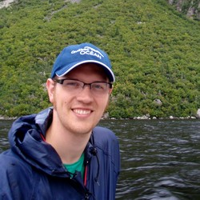
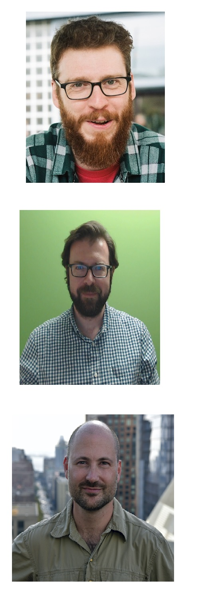

```{r setup, include=FALSE}
knitr::opts_chunk$set(echo = FALSE)
```


# Before we get started:

* Make sure you have R open, and the working directory set to where you put the files we sent out

  * If you are in RStudio, you can just open the project file

--

* The following packages should be installed:

  * `dplyr` and `tidyr` for data manipulation
  * `ggplot2` for visualization
  * `gratia` (for visualizing GAMs)
  * `sf` for manipulating spatial data

---

# Who I am


.left-column[ 
```{r}


```

]

.right-column[
Assistant professor at Concordia University in Montreal. I study rapid change in aquatic ecosystems, and developing methods for monitoring spatially structured communities
]


---

# This workshop would not be possible  except for these fantastic people:


.left-column[ 

```{r}


```
]

.right-column[


.small[David Lawrence Miller (Centre for Research into Ecological & Environmental Modelling, St Andrews University)]

----------------------------

.small[Gavin Simpson (Department of Animal Science, Aarhus University)]

----------------------------

.small[Noam Ross (Ecohealth Alliance)]


----------------------------


]

---


# What are we covering?


**Part 1: What's a GAM?** 

  *  Intro to GAM theory: basis functions and smoothing

  * Some useful types of smoothers

--

**Part 2 (after coffee): GAMs for movement data **

  * Choosing families to model complex data
  
  * Multi-dimensional smoothers and interactions
  
  * Some of the pitfalls of movement data

---

# What will be missing? 


Won't have time to cover in depth:

* Measuring uncertainty for complex smooths

* Evaluating model fit

See our prior workshop material for more info on these

---

# How I'll be running the workshop:


* If you have any questions, raise your hand or put a question in chat; 
I'll be checking the chat regularly


---


# Now on to the workshop! 
